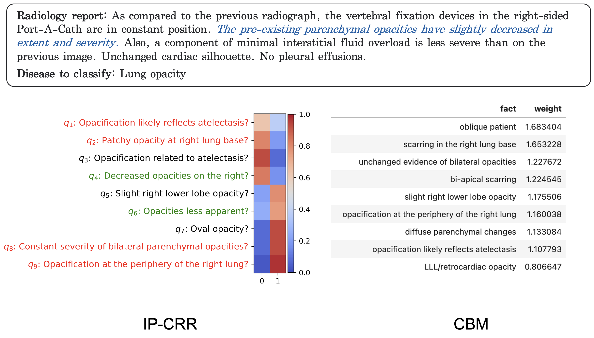

# MICCAI2025-IP-CRR
Anonymous code submission

## Abstract
The development of AI-based methods for analyzing radiology reports could lead to significant advances in medical diagnosis—from improving diagnostic accuracy to enhancing efficiency and reducing workload. However, the lack of interpretability in these methods has hindered their adoption in clinical settings. In this paper, we propose an interpretable-by-design framework for classifying radiology reports. The key idea is to extract a set of most informative queries from a large set of reports and use these queries and their corresponding answers to predict a diagnosis. Thus, the explanation for a prediction is, by construction, the set of selected queries and answers. We use the Information Pursuit framework to select informative queries, the Flan-T5 model to determine if facts are present in the report, and a classifier to predict the disease. Experiments on the MIMIC-CXR dataset demonstrate the effectiveness of the proposed method, highlighting its potential to enhance trust and usability in medical AI. 

## Results
### Qualitative results

Example 1: Lung Opacity  

Example 2: Cardiomegaly   

